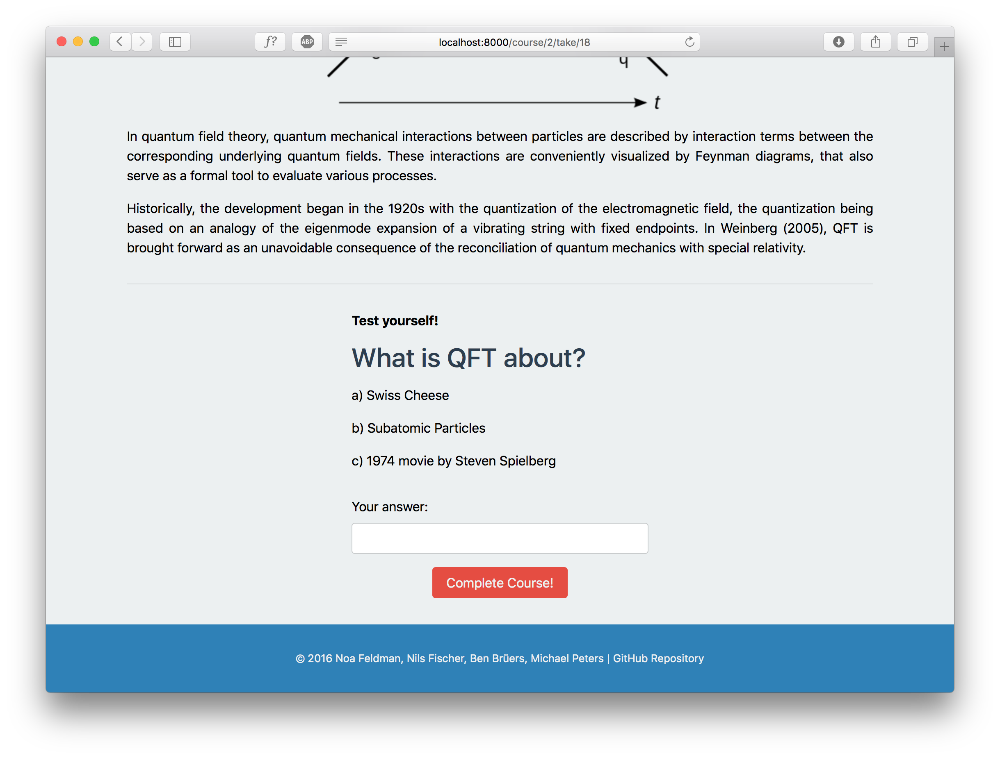

## Our Vision

Online education is becoming increasingly accessible to a wide variety of demographics. As a result, it has the potential to create opportunities for those otherwise unable to access it.

The newfound diversity of students presents considerable difficulties in ensuring that the educational material is effective for each demographic. To that end we propose to implement an A/B-testing framework that will automatically determine an optimal set of educational materials.

The teacher provides variations to their material, as well as tests to determine the student's success.

Our A/B-testing based algorithm adjusts the content of the course based on usage statistics and the results of the provided tests.

For example, our project will help refugees to learn the language of their asylum country. These language courses were hardly ever taught to populations with such dissimilar cultural backgrounds. Our framework will choose between various language teaching methods to ensure the quickest and most effective learning for each cultural origin, improving in quality with each user.

We can also apply the same technology to find the most effective explanation of a complicated physics concept based on the student's age, gender, cultural background, etc.

We envision our framework to be integrated into existing online education platforms. In this fashion, content creators on these platforms can opt-in to provide variations to their material. They can also choose a number of predictors (such as age, gender etc.) that students are required to provide when they take the course. The collected data then contributes to a shared database to not only generate insights for the specific course but also to abstract knowledge about the human learning process.

We believe our project can have a significant impact on online education quality.

## About this Project

We developed the idea and implemented the core functionality of this project from scratch during the [CERN Webfest 2016](http://webfest.web.cern.ch). The CERN Webfest is an annual hackathon for the summer students at CERN in Geneva, Switzerland to develop science and humanitarian projects over a weekend.

- [Final presentation (PDF)](finch_presentation.pdf)

**Developers:**

- [Noa Feldman](https://github.com/NoaFeldman)
- [Nils Fischer](https://github.com/knly)
- [Ben Brüers](https://github.com/gollumben)
- [Michael Peters](https://github.com/rooporoop)

## Screenshots

